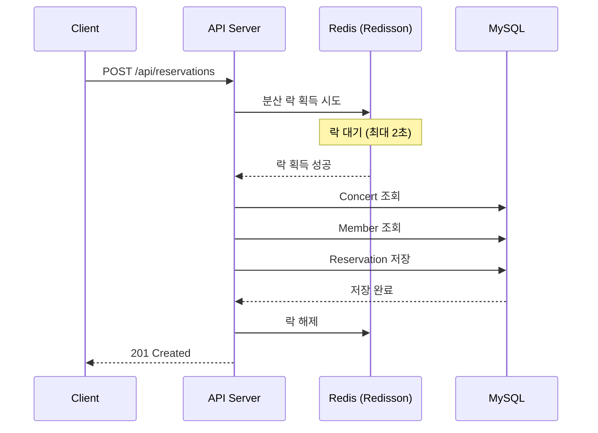
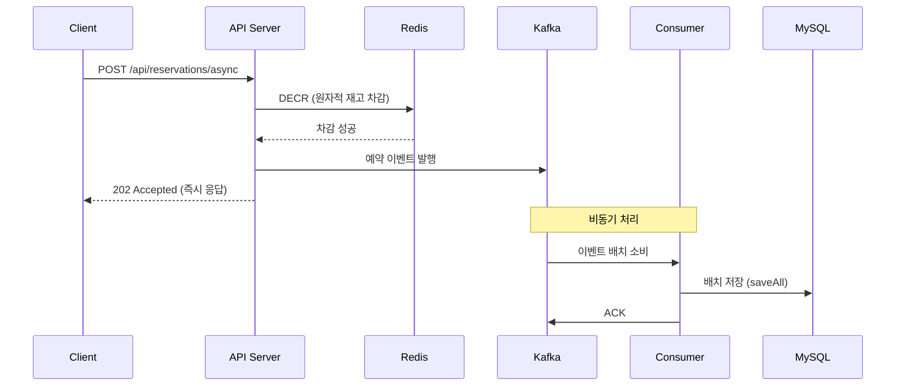
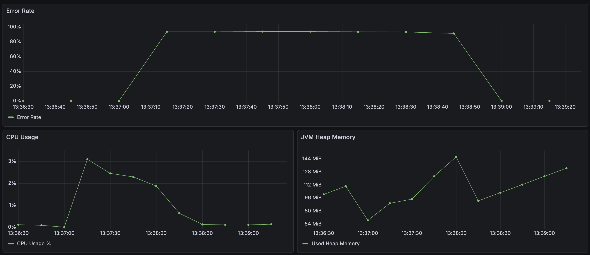
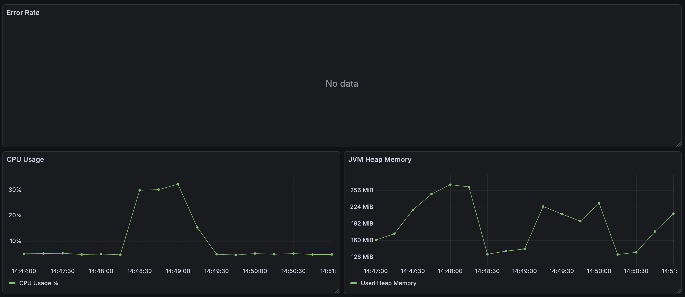
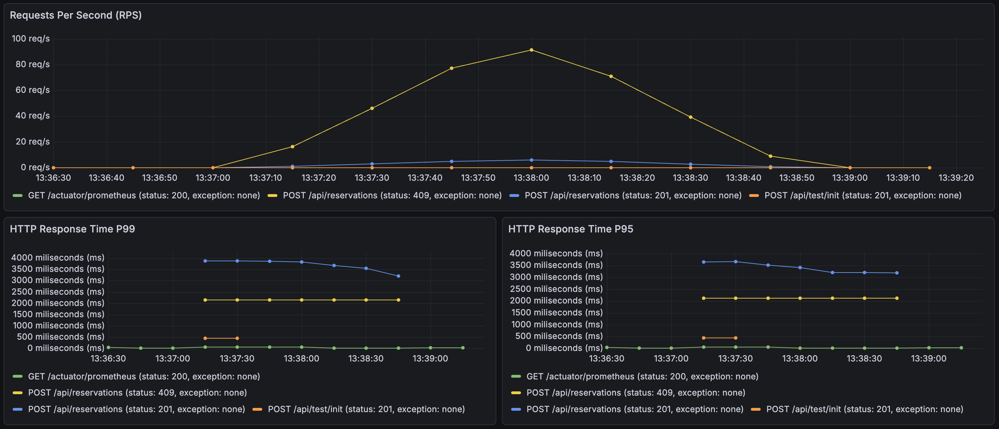
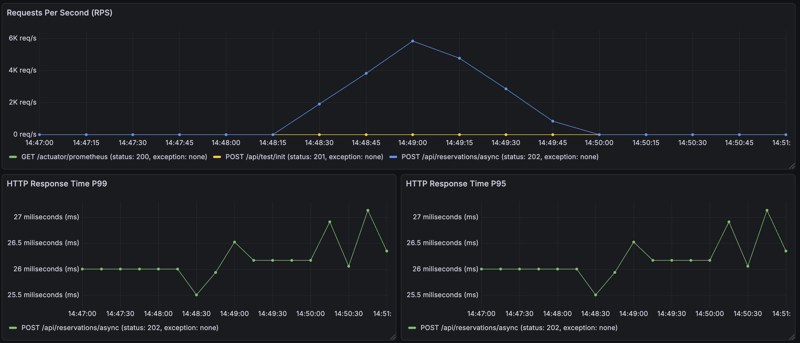
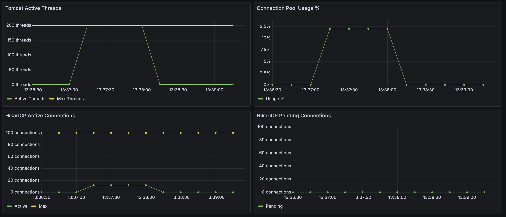
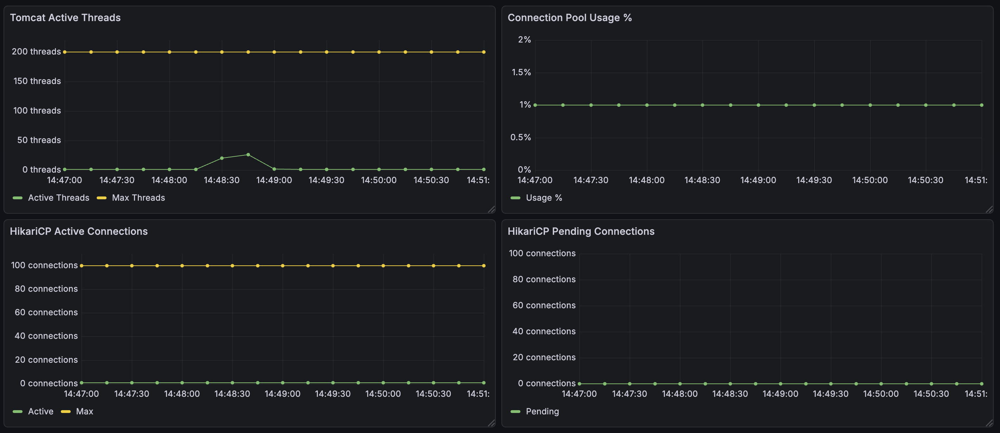

# Kafka 기반의 Event-Driven 아키텍처를 적용한 고성능 대규모 트래픽 처리 예약 시스템

## 목차
- [1. 프로젝트 요약](#1-프로젝트-요약)
- [2. 핵심 기술 스택](#2-핵심-기술-스택)
- [3. 아키텍처](#3-아키텍처)
  - [3.1 기존 동기 방식 (Redisson 분산 락)](#31-기존-동기-방식-redisson-분산-락)
  - [3.2 개선된 비동기 방식 (Redis + Kafka)](#32-개선된-비동기-방식-redis--kafka)
- [4. 핵심 성과](#4-핵심-성과)
  - [4.1 Error Rate, CPU Usage, JVM Heap Memory](#41-error-rate-cpu-usage-jvm-heap-memory)
  - [4.2 RPS, Response Time](#42-rps-response-time)
  - [4.3 Tomcat Threads, DB Connections](#43-tomcat-threads-db-connections)
- [5. 트러블슈팅](#5-트러블슈팅)
  - [5.1 Deadlock 및 데이터 정합성 문제 해결](#51-deadlock-및-데이터-정합성-문제-해결)
  - [5.2 DB Connection 점유 문제 해결](#52-db-connection-점유-문제-해결)
  - [5.3 분산 락의 성능 한계 극복](#53-분산-락의-성능-한계-극복)

---

<br>
<br>

## 1. 프로젝트 요약

콘서트 티켓 예약 시스템에서 발생하는 대규모 동시 트래픽을 안정적으로 처리하기 위해 Event-Driven 아키텍처를 설계하고 구현했습니다.

 비관적 락 동기 방식, Redisson 분산 락 동기 방식을 거쳐 Redis 원자적 연산과 Kafka 비동기 메시징을 결합한 구조로 전환하여, API 요청 시점에는 Redis로 재고를 즉시 차감하고 실제 DB 저장은 Kafka Consumer가 백그라운드에서 배치 처리하도록 개선했습니다.

이를 통해 API 응답 시간을 획기적으로 단축하고, DB 커넥션 병목을 해소하여 시스템 처리량을 대폭 향상시켰습니다.

### 성과 요약

| 지표 | 개선 전 | 개선 후 | 변화 |
|------|---------|---------|------|
| **에러율** | 95% | 0% | ${\textsf{\color{red}95\%p 감소}}$ |
| **처리량 (RPS)** | 100 req/s | 6,000 req/s | ${\textsf{\color{red}60배 향상}}$ |
| **응답 시간** | 3,500ms | 27ms | ${\textsf{\color{red}129배 감소}}$ |

<br>
<br>

## 2. 핵심 기술 스택

| 분류 | 기술 | 사용 목적 |
|------|------|-----------|
| **Backend** | Spring Boot 3.x, Java 17 | REST API 서버 구현 |
| **Database** | MySQL 8.4, JPA/Hibernate | 예약 데이터 영속화 |
| **Message Queue** | Apache Kafka | 비동기 이벤트 처리, 배치 소비 |
| **Cache** | Redis 7, Lettuce | 원자적 재고 관리 (DECR/INCR) |
| **Distributed Lock** | Redisson | 동기 방식 비교 테스트용 분산 락 |
| **Containerization** | Docker Compose | 로컬 개발 환경 구성 |
| **Monitoring** | Prometheus, Grafana | 메트릭 수집 및 시각화 |
| **Load Testing** | k6 | 부하 테스트 및 성능 측정 |

<br>
<br>

## 3. 아키텍처

### 3.1 기존 동기 방식 (Redisson 분산 락)



**설계 의도 및 한계점:**
Redisson 분산 락을 통해 동일 콘서트에 대한 동시 예약 요청을 직렬화하여 데이터 정합성을 보장했습니다.
그러나 락 획득 대기, DB 조회/저장이 모두 동기적으로 처리되어 Tomcat 쓰레드가 오랜 시간 점유되고,
락 경합이 심해지면 타임아웃이 빈번하게 발생하여 대규모 트래픽에서 95% 이상의 에러율을 기록했습니다.

---

### 3.2 개선된 비동기 방식 (Redis + Kafka)



**설계 의도:**
API 요청 처리와 DB 저장을 분리하여 응답 시간을 최소화했습니다.
Redis의 DECR 명령은 원자적(atomic)으로 동작하므로 별도의 분산 락 없이도 재고 정합성을 보장하며,
Kafka Consumer가 단일 쓰레드로 배치 처리하여 DB 커넥션을 1개만 사용하므로 리소스 효율이 극대화됩니다.
이를 통해 API 서버는 6,000 RPS를 안정적으로 처리하고, 평균 응답 시간을 27ms로 단축했습니다.

<br>
<br>

## 4. 핵심 성과

### 4.1 Error Rate, CPU Usage, JVM Heap Memory

| 지표 | Before | After | 변화 |
|:-----|-------:|------:|:----:|
| **Error Rate** | 95% | 0% | ${\textsf{\color{red}↓ 95\%p}}$ |
| **CPU Usage** | 3% | 30% | ↑ 10배 |
| **JVM Heap Memory** | 128 MiB | 224 MiB | ↑ 1.75배 |

<br>

> **Kafka 도입 전**



> **Kafka 도입 후**



---

### 4.2 RPS, Response Time

| 지표 | Before | After | 변화 |
|:-----|-------:|------:|:----:|
| **RPS** | 100 req/s | 6,000 req/s | ${\textsf{\color{red}↑ 60배}}$ |
| **Response Time P99** | 3,700 ms | 27 ms | ${\textsf{\color{red}↓ 137배}}$ |
| **Response Time P95** | 3,500 ms | 27 ms | ${\textsf{\color{red}↓ 129배}}$ |

<br>

> **Kafka 도입 전**



> **Kafka 도입 후**



---

### 4.3 Tomcat Threads, DB Connections

| 지표 | Before | After | 변화 |
|:-----|-------:|------:|:----:|
| **Tomcat Active Threads** | 200 | 20 | ${\textsf{\color{red}↓ 10배}}$ |
| **HikariCP Active Connections** | 12 | 1 | ${\textsf{\color{red}↓ 12배}}$ |
| **HikariCP Pending Connections** | 10 | 0 | ↓ 100% |

<br>

> **Kafka 도입 전**



> **Kafka 도입 후**



<br>
<br>

## 5. 트러블슈팅

### 5.1 Deadlock 및 데이터 정합성 문제 해결

#### 문제 상황
동시성 제어 없이 100개의 동시 예약 요청을 전송했을 때, MySQL에서 약 80개의 트랜잭션이 ${\textsf{\color{red}순환 대기 상태(Deadlock)}}$에 빠졌습니다.
MySQL은 교착 상태를 감지하고 80개의 트랜잭션을 강제 Rollback시켜 약 20개만 성공했습니다.
더 심각한 문제는 성공한 20개 트랜잭션조차 ${\textsf{\color{red}Race Condition}}$으로 인해 **생성된 예약 수 ≠ 감소된 좌석 수**라는 ${\textsf{\color{red}데이터 정합성 오류}}$가 발생한 것입니다.

#### 원인 분석
MySQL은 SELECT 시에는 Lock을 걸지 않지만, UPDATE/INSERT 시에는 행 단위 Lock을 겁니다.
여러 트랜잭션이 동시에 같은 행을 수정하려 할 때 순환 대기가 발생하여 Deadlock이 발생했습니다.

#### 해결 방법
${\textsf{\color{red}비관적 락(Pessimistic Lock)}}$을 적용하여 `SELECT ... FOR UPDATE` 구문으로 조회 시점에 배타적 Lock을 획득하도록 했습니다.
이를 통해 동일 콘서트에 대한 동시 요청을 직렬화하여 Deadlock과 데이터 정합성 문제를 모두 해결했습니다.

---

### 5.2 DB Connection 점유 문제 해결

#### 문제 상황
비관적 락으로 Deadlock은 해결했지만, 새로운 문제가 발생했습니다.
락을 획득하고 대기하는 동안 ${\textsf{\color{red}DB 커넥션을 계속 점유}}$하는 것입니다.
티켓팅처럼 트래픽이 순간적으로 몰리는 상황에서는 ${\textsf{\color{red}Connection Pool 고갈}}$로 예약뿐만 아니라 단순 회원 조회 같은 다른 기능도 마비되는 ${\textsf{\color{red}서비스 전체 장애(SPOF)}}$로 이어질 수 있었습니다.

#### 원인 분석
비관적 락은 트랜잭션 내에서 동작하므로, 락 대기 시간 동안 DB 커넥션을 반환하지 않습니다.

#### 해결 방법
${\textsf{\color{red}Redisson 분산 락}}$을 도입하여 락 대기를 DB가 아닌 Redis에서 처리하도록 변경했습니다.
Redisson은 ${\textsf{\color{red}Pub/Sub 방식}}$으로 락을 관리하여 Redis에 대한 부하도 최소화합니다.

공격 조(30명)이 공연을 예약하는 요청을 보낸 후 피해자 조(10명)이 0.1초 뒤에 회원 조회를 하는 시나리오를 테스트하여 Redisson 분산 락의 성능을 직접 확인하였습니다. 

| 비교 항목 | 비관적 락 | Redisson 분산 락 |
|----------|:--------:|:---------------:|
| 처리 속도 | 224 TPS | 123 TPS |
| DB 커넥션 점유 | O | X |
| 서비스 격리성 | 낮음 | 높음 |

속도는 비관적 락이 1.8배 빨랐지만, 이는 Redis 네트워크 오버헤드(RTT) 때문입니다.
그러나 **시스템 안정성과 격리성**을 고려하여 Redisson 분산 락을 최종 선택했습니다.  

---

### 5.3 분산 락의 성능 한계 극복

#### 문제 상황
Redisson 분산 락으로 안정성은 확보했지만, 대규모 트래픽(2000 VUs)에서 ${\textsf{\color{red}95\% 이상의 에러율}}$이 발생했습니다.
주요 에러는 "${\textsf{\color{red}락 획득 실패(58\%)}}$"와 "${\textsf{\color{red}쓰레드 풀 부족(38\%)}}$"이었습니다.

#### 원인 분석
분산 락 내에서 **DB 조회(Concert, Member) + DB 저장(Reservation)** 을 모두 동기적으로 처리했기 때문입니다.
락을 오래 점유하면 다른 요청들이 락 획득에 실패하고, Tomcat 쓰레드도 오래 점유되어 풀이 고갈됩니다.

#### 해결 방법
${\textsf{\color{red}Redis 원자적 연산 + Kafka 비동기 처리}}$ 아키텍처로 전환했습니다.

1. **분산 락 제거**: Redis의 `DECR` 명령은 ${\textsf{\color{red}원자적(atomic)}}$이므로 별도 락 없이 재고 정합성 보장
2. **DB 작업 분리**: API는 Redis 재고 차감 + Kafka 이벤트 발행만 수행하고 ${\textsf{\color{red}즉시 응답}}$
3. **배치 처리**: Kafka Consumer가 백그라운드에서 DB 저장을 ${\textsf{\color{red}배치로 처리}}$

```
Before: API → 분산 락 획득 → DB 조회 → DB 저장 → 락 해제 → 응답 (3,500ms)
After:  API → Redis DECR → Kafka 발행 → 응답 (27ms)
        Consumer → DB 배치 저장 (백그라운드)
```
